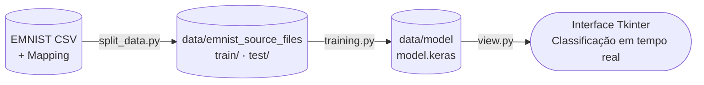

# Modelo indentificar Vogais, Algarismo e consoante
---


## Estrutura do projeto
```
Vogais/
├── data/
├── notebook/ ➔ Código comentado
├──── instal_dataset.ipynb/ 
├──── slipt_data.ipynb/ 
├──── training.ipynb/ 
├── src/ 
├──── instal_dataset.py/ 
├──── slipt_data.py/ 
├──── training.py/ 
├──── view.py/ 
└── requirements.txt
```

## Como usar

### 1. Instalar 

#### Criar ambiente
``` bash
python3 -m venv venv
```
#### Instala  dependências
```bash 
pip install -r requirements.txt
```

## Dataset 
https://www.kaggle.com/datasets/crawford/emnist/data

**Configurações:**
| Parâmetro | Valor |
|-----------|-------|
| Tamanho da imagem | 28×28 pixels |
| Batch size | 128 |
| Épocas máximas | 30 |
| Seed | 42 |

## Dataset EMNIST
| Split | Imagens |
|-------|---------|
| Treino| 529.006|
| Teste | 88.299  |
| Total | 617.305 | 

## Visão Geral do Pipeline Completo


